### Cel warsztatu

Celem warsztatu jest zbudowanie potoku automatyzacji wykorzystującego model AI dostępny w serwisie Groq.com. Źródłem danych jest formularz generowany na podstawie bazy danych w serwisie Baserow.

Gotowy potok wyglądać będzie następująco:

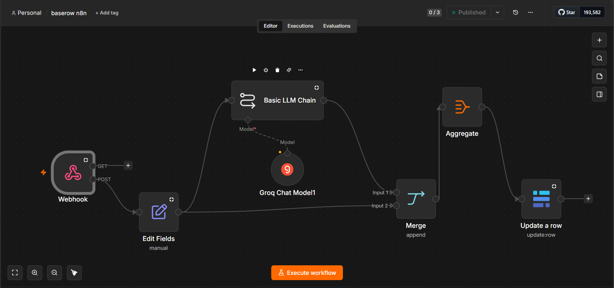

### 1. Założenie konta w serwisie GitHub i uruchomienie CodeSpace

Załóż konto w serwisie GitHub. Serwis GitHub umożliwia wspólną pracę nad projektami z programowania, ale również zdalną pracę w izolowanym środowisku (dzisiaj skorzystamy z drugiej opcji)

[Zarejestruj się w GitHub](https://github.com/signup)

Po rejestracji konta i zalogowaniu się do GitHuba, przejdź [do tego adresu](https://github.com/lukaszchomatek/studyadvisor)

Kliknij przycisk **Fork**, żeby uttworzyć własną kopię repozytorium

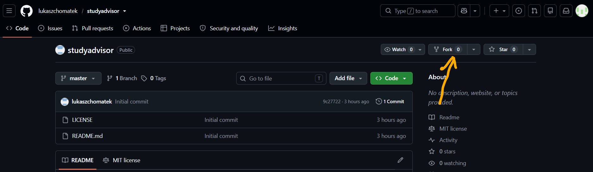

W formularzu, który się pojawi, kliknij "Create fork"

### 1.a Utworzenie Codespace

Aby utworzyć nowe środowisko do programowania, kliknij przycisk "Code", następnie przejdź do zakładki "Codespaces" i kliknij "Create new".
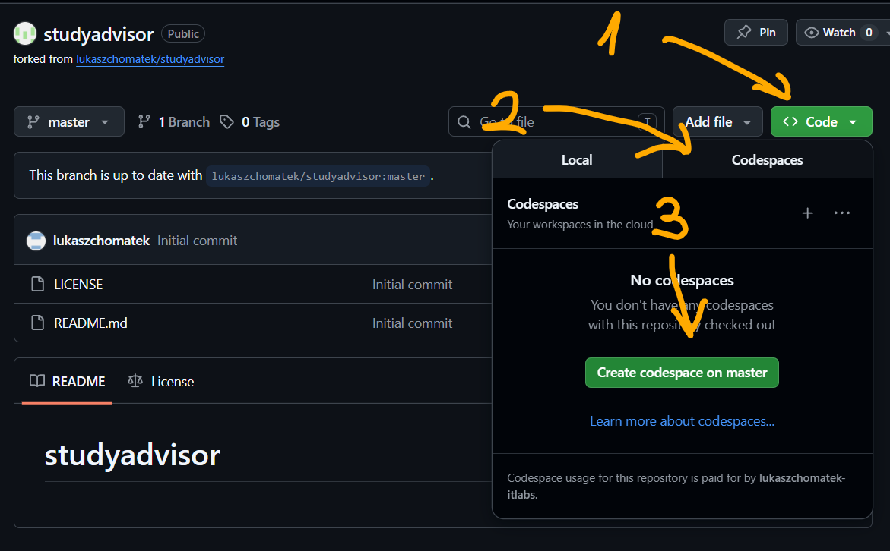

### 2. Intalacja narzędzia do automatyzacji n8n

1. Otwórz terminal (`Ctrl+Shift+C`)

2. Wykonaj następującą komendę, żeby zainstalować narzędzie **n8n**. Ponieważ trwa to kilka minut, przejdź do kolejnego punktu - założenie konta w serwisie BaseRow.

`npm install n8n -g`

### 3. Założenie konta w serwisie Baserow

Baserow jest narzędziem umożliwiającym posługiwanie się *prawdziwą* bazą danych przy pomocy GUI. Baza danych jest udostępniana w Internecie. Do wprowadzania danych można tworzyć wygodne formularze i udostępniać je użytkownikom. Dane wprowadzane do formularzy znajdą się w bazie danych.

[Rejestracja w Baserow](https://baserow.io/signup)

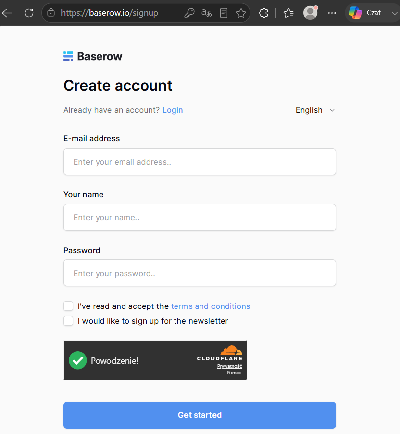

### 3.a Utworzenie bazy danych w serwisie Baserow

Po utworzeniu konta i zalogowaniu się do serwisu BaseRow możemy utworzyć bazę danych. Proszę o wpisanie nazwy "Studies" jako nazwy bazy danych.

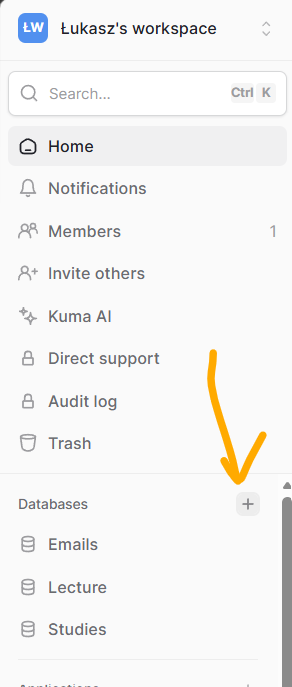

### 3.b Zmiana domyślnej nazwy tabeli i edycja kolumn

Żeby wygodniej się pracowało, zmieńmy domyślną nazwę tabeli na **StudentProfile**

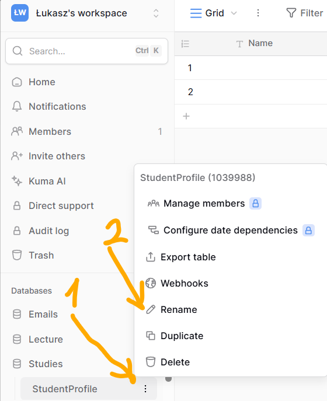

Zmień nazwy kolumn i typy danych na następujące:

- **fav_subjects** - single line text
- **hobbies** - single line text
- **suggested_studies** - Long text

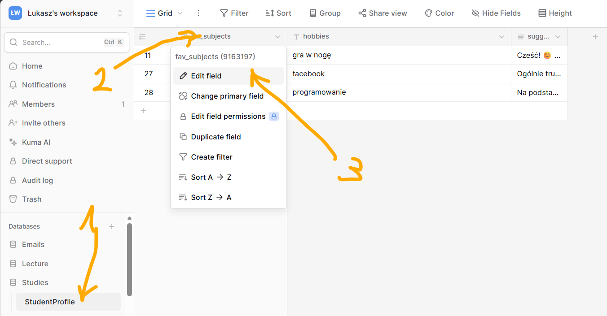

### 4. Utworzenie formularza do wprowadzania danych

W widoku tabeli kliknij widok "Grid" (domyślny) a następnie z menu wybierz utworzenie nowego formularza. Nazwij go **StudySuggestions**

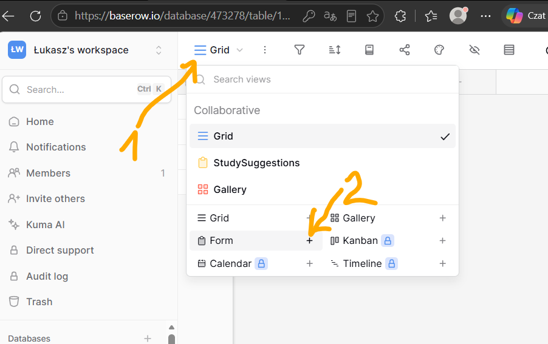

Wypełnij formularz przeciągając na niego dwie pierwsze kolumny z tabeli. Ostatnią kolumnę wypełni model AI.

Gotowy formularz może wyglądać np. tak:

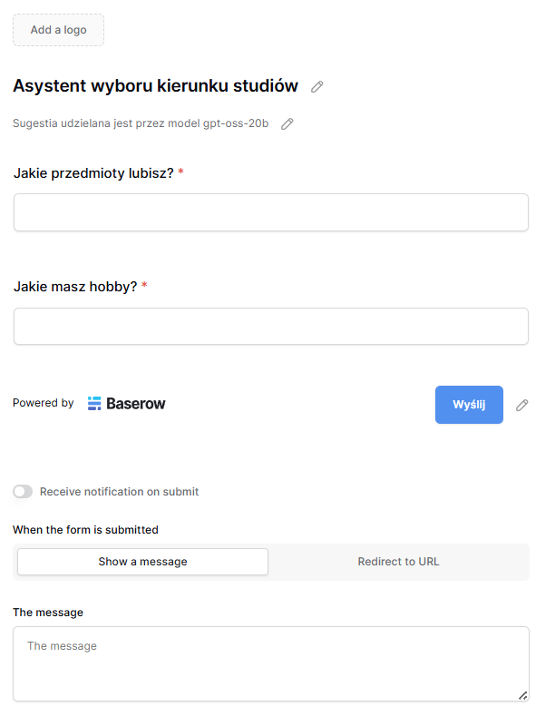

Skopiuj link do formularza, otwórz go w nowym oknie przegląrki i przetestuj.

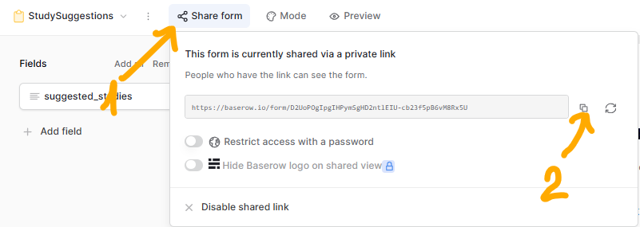

### 5. Utworzenie klucza dostępowego do Baserow

Zewnętrzne aplikacje (w naszym przypadku n8n) potrzebują dostępu do Baserow. Nie powinien być on anonimowy, ponieważ wtedy każdy mógłby podejrzeć zawartość naszej bazy i zapisać tam dowolne dane.

Zewnętrzne aplikacje uzyskują dostęp do Baserow przy pomocy tzw. tokena. Token tworzy się z poziomu ustawień użytkownika. Można nadać tokenowi dowolną nazwę, np. **demotoken**

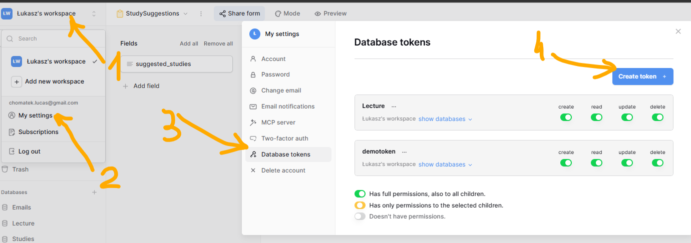

### 6. Uruchomienie n8n

Wróć do swojego Github Codespace i uruchom n8n wpisując w terminalu:

```n8n start```

Otwórz narzędzie w przeglądarce:

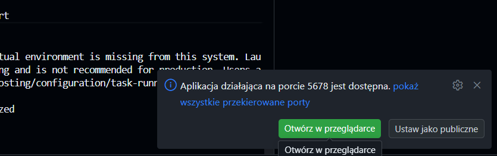

Zostaniesz następnie poproszony o zaakceptowanie połączenia. Kliknij "Continue".

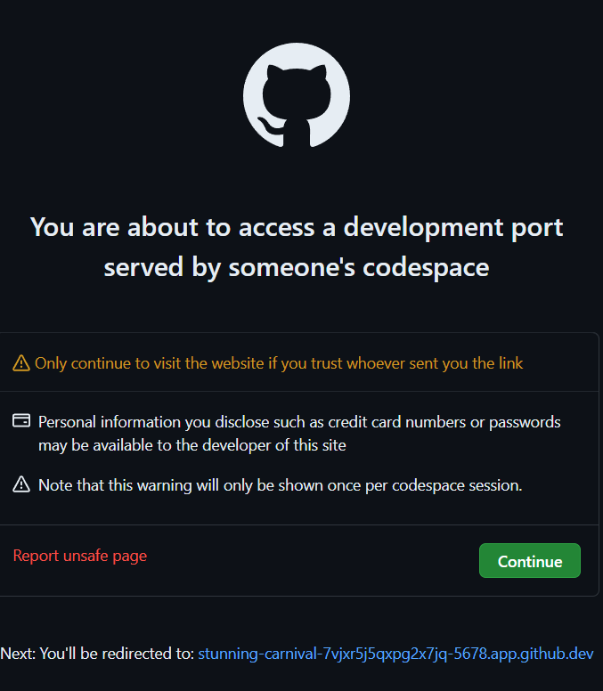

Przy pierwszym uruchomieniu n8n wypełnij formularz (nie zapomnij hasła)

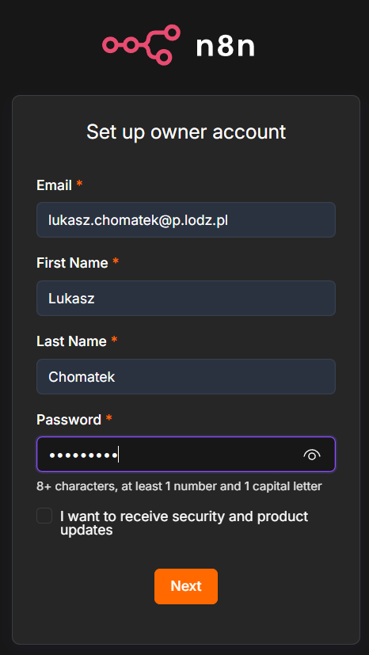

Pomiń dwa kolejne formularze.

### 7. Załóż konto Groq.

Przejdź na [groq.com](https://www.groq.com) i kliknij "Start building". Zaloguj się kontem Google lub GitHubowym.

Kliknij duży przycisk "Create API Key" a następnie skopiuj utworzony klucz i zapisz go np. w pliku tekstowym (lub w dokumentach Google). **Klucz będzie widoczny tylko raz, więc nie należy go gubić.** Na szczęście można go usunąć i utworzyć nowy.

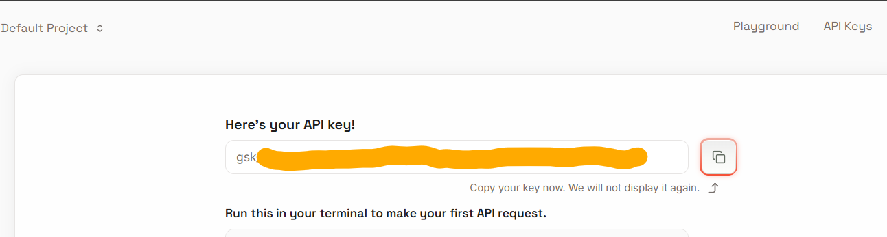

### 